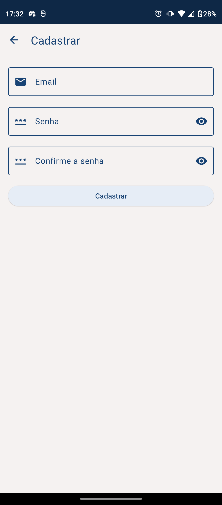

# Student Diary<h1 align="center">Student Diary</h1>

<p align="center">
   <a href="https://opensource.org/licenses/Apache-2.0"></a>
   <a href="https://android-arsenal.com/api?level=27"></a>
  <br>
  <a href="https://wa.me/+5532998002817"></a>
  <a href="https://www.linkedin.com/in/leonardotissi/"></a>
  <a href="mailto:leonardo.tissi.si@gmail.com"></a>
</p>

<p align="center">  

⭐ Esse é um projeto para demonstrar meu conhecimento técnico no desenvolvimento Android nativo com Kotlin. Mais informações técnicas abaixo.

O aplicativo desenvolvido apresenta a capacidade de gerenciar as disciplinas às quais o usuário se comprometeu a estudar, utilizando um sistema completo de Create, Read, Update e Delete (CRUD) implementado através da biblioteca Room. Além disso, o aplicativo oferece funcionalidades adicionais, como um dicionário e a aplicação do Método Pomodoro de estudos. Durante o processo de desenvolvimento, foi criada uma API utilizando Spring Boot em Kotlin para acessar as informações disponíveis no site Dicio.com.br. O Retrofit foi empregado para realizar consultas a essa API. A integração com os serviços do Firebase também desempenha um papel significativo no aplicativo. Foram utilizados recursos do Firebase, como o Auth, que possibilita a autenticação dos usuários por meio de email, senha, contas Google e Facebook, permitindo a personalização das contas, recuperação de senha, exclusão e criação de contas. O Firebase Firestore foi empregado para gerenciar informações compartilhadas entre os usuários, incluindo um sistema de sugestões de concursos públicos e plataformas de cursos preparatórios e também para guardar o token dos usuários. O armazenamento de imagens de perfil dos usuários foi implementado por meio do Firebase Storage. O Firebase Cloud Messaging foi utilizado para a transmissão de notificações segmentadas. A aplicação faz uso do broadcastReceiver para monitorar informações do dispositivo, tais como o status do modo avião, da bateria e ações das notificações do método pomodoro. A tecnologia Work Manager foi empregada para assegurar o envio do token gerado no Firebase Cloud Messaging, possibilitando, assim, o envio de notificações direcionadas. Além disso, o Work Manager é responsável por adicionar lembretes por meio de notificações, reforçando a lembrança dos horários determinados para estudo. Para viabilizar a execução do Método Pomodoro em segundo plano, juntamente com notificações e ações relacionadas, foi utilizado o Service. A navegação entre telas e a transferência de argumentos foram implementadas através da biblioteca Navigation, em conjunto com o Safe Args. A injeção de dependência foi gerenciada pela biblioteca Koin. O carregamento de imagens via URL foi efetuado por meio da biblioteca Coil, enquanto janelas de navegadores customizadas foram criadas com o auxílio da biblioteca Browser. A interface do aplicativo incorpora navegação por meio da toolbar. Para aprimorar a segurança, a biblioteca Biometric foi empregada para requerer credenciais ao enviar sugestões. Animações em XML foram introduzidas através da biblioteca Lottie Animation. O gerenciamento de informações em cache foi implementado por meio do DataStore. Recursos do Kotlin, tais como ENUM Class, Data class, extensions, coroutines, entre outros, foram utilizados para otimizar o desenvolvimento. Adicionalmente, o aplicativo faz uso do sensor de temperatura, explorando funcionalidades do hardware para fornecer informações relevantes aos usuários.
Além das tecnologias mencionadas anteriormente, o desenvolvimento do aplicativo também fez uso de outras tecnologias convenientes para o ambiente Android, enriquecendo ainda mais a experiência do usuário e a eficácia do aplicativo.

</p>

</br>

<p float="left" align="center">





</p>

Faça o download da <a href="/app/release/app-release.apk?raw=true">APK diretamente</a>. Você pode ver <a href="https://www.google.com/search?q=como+instalar+um+apk+no+android">aqui</a> como instalar uma APK no seu aparelho android.

## Tecnologias usadas e bibliotecas de código aberto

- Minimum SDK level 27
- [Linguagem Kotlin](https://kotlinlang.org/)

- Jetpack
  - Lifecycle: Observe os ciclos de vida do Android e manipule os estados da interface do usuário após as alterações do ciclo de vida.
  - ViewModel: Gerencia o detentor de dados relacionados à interface do usuário e o ciclo de vida. Permite que os dados sobrevivam a alterações de configuração, como rotações de tela.
  - ViewBinding: Liga os componentes do XML no Kotlin através de uma classe que garante segurança de tipo e outras vantagens.
  - Custom Views: View customizadas feitas do zero usando XML.
  - LifecycleScope: Para execuções em coroutine.
  - DataStore: Armazenamento de dados em cache.
  - View Binding - Gerenciar views.
  - Fragment 
  - Navigation - Criação e estruturação da IU do app, gerenciando links diretos e navegação entre telas.
  - Room - Criação e gerenciamento de dados persistentes em um banco de dados SQLite
  - Work Manager - Gerenciar tarefas em segundo plano baseadas em restrições
  - Biometric - Autenticação com biometria ou credenciais do dispositivo
  - Browser - Exibir páginas da web no navegador padrão do usuário
  - Coroutines
  

 
- Arquitetura
  - MVVM (View - ViewModel - Model)
  - Comunicação da ViewModel com a View através de LiveData
  - Repositórios para comunicação entre o viewModel e o Retrofit
  

- Bibliotecas
  - [Firebase:](https://firebase.google.com/) Conjunto de serviços da Google fortemente indicados para o desenvolvimento Android.
  - [Retrofit2:](https://github.com/square/retrofit) Para realizar requisições seguindo o padrão HTTP.
  - [Koin:](https://insert-koin.io/) Para Injeção de dependência
  - [Coil:](https://github.com/coil-kt/coil) Para load de imagens a partir da URL.
  - [Lottie Animation:](https://lottiefiles.com/) Animações para XML.
  - [Google auth:](https://firebase.google.com/docs/auth/android/google-signin?hl=pt-br) Autenticação através da conta Google.
  - [Facebook auth:](https://developers.facebook.com/docs/facebook-login/overview) Autenticação através da conta Google

 
 

## Arquitetura

**Student Diary** utiliza a arquitetura MVVM e o padrão de Repositories, que segue as [recomendações oficiais do Google](https://developer.android.com/topic/architecture).
</br></br>

<div align="center" style=" width: 100%; background-color: white; ">

</div>
<br>

## API Utilizada

- [Dicionário API:](https://github.com/DevLeonardoTissi/DicionarioAPI)  Api feita por mim capaz de realizar consultas ao site Dicio.com.br


## Features
### Firebase Services
### Room database
### Work manager
### Services
### Broadcast Receiver
### Data Store
### Material Design Components
### View Binding
### Navigation

<br>

<div align="center" style=" width: 100%; display: inline-block;  justify-content: space-between;">
  


</div>


# Licença

```xml
Copyright [2023] [Leonardo Tissi]

Licensed under the Apache License, Version 2.0 (the "License");
you may not use this file except in compliance with the License.
You may obtain a copy of the License at

  http://www.apache.org/licenses/LICENSE-2.0

Unless required by applicable law or agreed to in writing, software
distributed under the License is distributed on an "AS IS" BASIS,
WITHOUT WARRANTIES OR CONDITIONS OF ANY KIND, either express or implied.
See the License for the specific language governing permissions and
limitations under the License.
```
